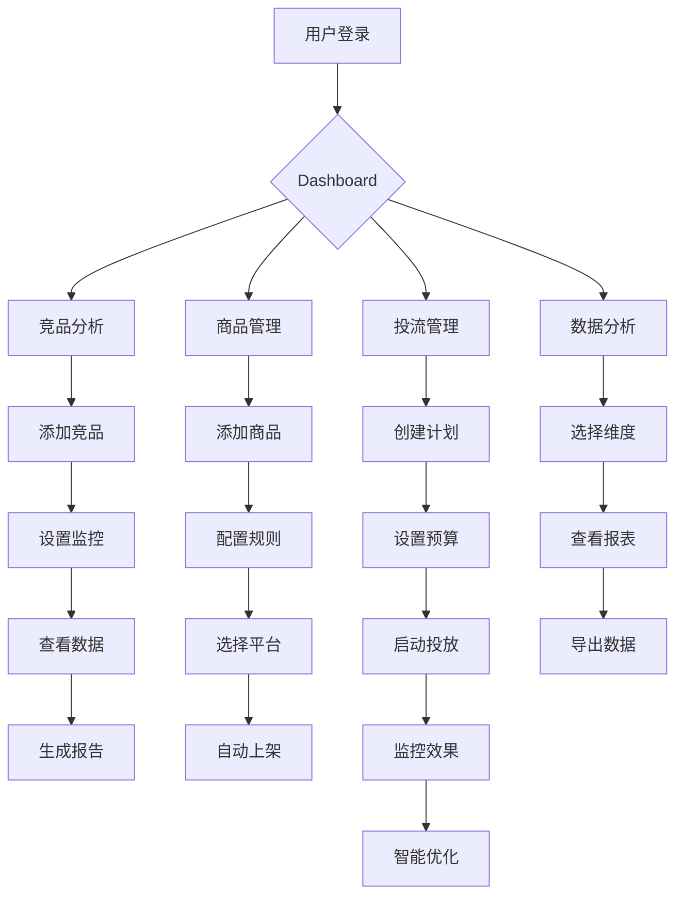

# 陇渭本草全渠道电商自动化运营平台 - 产品需求文档

## 1. Product Overview
陇渭本草全渠道电商自动化运营平台是一款专为中药材企业打造的一站式智能运营系统，整合淘宝、天猫、小红书、抖音、京东等主流电商平台，提供竞品分析、自动上架、智能投流、数据分析等核心功能，实现全渠道统一管理和智能化运营。

- **核心目标**: 帮助中药材企业实现多平台电商运营自动化，提升运营效率，降低人力成本，增强市场竞争力
- **目标用户**: 陇渭本草品牌运营团队、电商管理人员、数据分析人员
- **市场价值**: 打通全渠道数据孤岛，实现智能化决策，助力品牌在中药材电商领域持续增长

## 2. Core Features

### 2.1 User Roles
| Role | Registration Method | Core Permissions |
|------|---------------------|------------------|
| 超级管理员 | 邮箱注册/邀请 | 所有功能权限，用户管理，系统配置 |
| 运营主管 | 邀请注册 | 竞品分析、商品上架、投流管理、数据分析 |
| 运营专员 | 邀请注册 | 商品上架、基础数据分析 |
| 数据分析师 | 邀请注册 | 数据分析、报表查看、导出 |

### 2.2 Feature Module
1. **Dashboard首页**: 数据概览、关键指标、快捷入口
2. **竞品分析模块**: 竞品监控、价格分析、销量对比、趋势洞察
3. **商品管理模块**: 商品库、自动上架、库存同步、多平台分发
4. **投流管理模块**: 投放计划、预算控制、效果追踪、智能优化
5. **数据分析模块**: 销售数据、流量数据、转化数据、可视化报表
6. **平台接入模块**: 淘宝/天猫/小红书/抖音/京东API接入配置
7. **用户管理模块**: 账号管理、角色权限、团队协作
8. **系统设置模块**: 品牌配置、通知设置、数据备份

### 2.3 Page Details

| Page Name | Module Name | Feature description |
|-----------|-------------|---------------------|
| Dashboard首页 | 数据概览 | 展示各平台销售总额、订单量、转化率、流量等核心指标的实时数据卡片 |
| Dashboard首页 | 快捷入口 | 竞品分析、商品上架、投流管理、报表导出等常用功能的快速访问入口 |
| Dashboard首页 | 趋势图表 | 销售趋势、流量趋势、竞品对比等可视化图表 |
| 竞品分析 | 竞品监控 | 添加竞品商品，实时监控价格变化、销量波动、评价动态 |
| 竞品分析 | 价格分析 | 竞品价格区间分析、价格趋势追踪、价格策略建议 |
| 竞品分析 | 销量对比 | 多竞品销量数据对比，市场份额分析 |
| 竞品分析 | 趋势洞察 | 竞品运营策略分析、新品上架监测、促销活动追踪 |
| 商品管理 | 商品库 | 商品信息管理、分类管理、属性管理、图片管理 |
| 商品管理 | 自动上架 | 配置上架规则，定时自动发布商品到各平台 |
| 商品管理 | 库存同步 | 多平台库存实时同步，预警提醒 |
| 商品管理 | 多平台分发 | 一键分发商品到多个电商平台 |
| 投流管理 | 投放计划 | 创建和管理广告投放计划，设置投放平台、时间、预算 |
| 投流管理 | 预算控制 | 实时监控投放消耗，超支预警，自动调整 |
| 投流管理 | 效果追踪 | 曝光量、点击量、转化率、ROI等投放效果数据追踪 |
| 投流管理 | 智能优化 | 基于数据分析自动优化投放策略，提升ROI |
| 数据分析 | 销售数据 | 各平台销售额、订单量、客单价、复购率等数据统计 |
| 数据分析 | 流量数据 | 访客数、浏览量、来源渠道、停留时长等流量分析 |
| 数据分析 | 转化数据 | 转化率、加购率、收藏率、成交率等转化指标 |
| 数据分析 | 可视化报表 | 多维度数据报表，支持图表切换和数据导出 |
| 平台接入 | API配置 | 各电商平台API密钥配置、授权管理 |
| 平台接入 | 连接状态 | 显示各平台连接状态，测试连接，重新授权 |
| 用户管理 | 账号管理 | 用户列表、新增用户、编辑用户信息 |
| 用户管理 | 角色权限 | 角色创建、权限分配、角色管理 |
| 用户管理 | 团队协作 | 团队成员查看、工作分配、操作日志 |
| 系统设置 | 品牌配置 | 品牌信息、Logo上传、主题设置 |
| 系统设置 | 通知设置 | 邮件通知、短信通知、预警阈值设置 |
| 系统设置 | 数据备份 | 手动备份、自动备份配置、数据恢复 |

## 3. Core Process

### 3.1 商品上架流程
用户登录 → 进入商品管理 → 添加/编辑商品信息 → 设置上架规则 → 选择目标平台 → 执行自动上架 → 查看上架状态 → 监控销售数据

### 3.2 竞品分析流程
进入竞品分析 → 添加竞品商品 → 设置监控频率 → 查看竞品数据 → 分析价格/销量趋势 → 生成分析报告 → 制定应对策略

### 3.3 投流管理流程
进入投流管理 → 创建投放计划 → 设置预算和目标 → 选择投放平台 → 启动投放 → 实时监控效果 → 智能优化调整 → 查看投放报表

## 4. User Interface Design

### 4.1 Design Style
- **主色调**: 深绿色(#1A472A) - 代表中药材、健康、自然
- **辅助色**: 金色(#D4AF37) - 代表品质、高端
- **中性色**: 深灰(#2D3748)、浅灰(#E2E8F0)、白色(#FFFFFF)
- **按钮风格**: 圆角矩形，主色背景配白色文字，悬停时颜色加深
- **字体**: 中文使用"思源黑体"，英文使用"Inter"
- **字体大小**: 标题24px，副标题18px，正文14px，辅助文字12px
- **布局风格**: 左侧导航栏 + 右侧内容区，卡片式布局，数据可视化为主

### 4.2 Page Design Overview

| Page Name | Module Name | UI Elements |
|-----------|-------------|-------------|
| Dashboard首页 | 数据概览 | 4-6个数据卡片，展示核心指标，带数字动画效果 |
| Dashboard首页 | 趋势图表 | 折线图/柱状图，支持时间范围切换 |
| Dashboard首页 | 快捷入口 | 图标+文字的功能入口卡片，悬停放大效果 |
| 竞品分析 | 竞品列表 | 表格形式展示竞品信息，支持筛选和排序 |
| 竞品分析 | 价格趋势 | 折线图展示价格变化，支持时间范围选择 |
| 商品管理 | 商品列表 | 卡片式布局展示商品，带图片和基本信息 |
| 商品管理 | 上架配置 | 表单配置上架规则，支持定时设置 |
| 投流管理 | 投放计划 | 列表展示投放计划，状态标签，操作按钮 |
| 投流管理 | 效果追踪 | 实时数据仪表盘，关键指标展示 |
| 数据分析 | 报表页面 | 多图表组合，支持切换维度，数据导出按钮 |
| 平台接入 | 连接配置 | 卡片展示各平台，连接状态指示器，配置按钮 |
| 用户管理 | 用户列表 | 表格展示用户信息，角色标签，操作列 |
| 系统设置 | 设置表单 | 分组表单，品牌Logo上传，通知配置 |

### 4.3 Responsiveness
- **Desktop**: 完整功能展示，左侧导航栏固定，右侧内容区自适应
- **Tablet**: 导航栏折叠为汉堡菜单，内容区调整为两列布局
- **Mobile**: 导航栏转为底部标签页，卡片堆叠展示，支持横向滚动

### 4.4 交互设计
- **加载状态**: 使用骨架屏或渐入动画
- **悬停效果**: 按钮和卡片悬停时阴影加深、颜色微变
- **数据更新**: 实时数据自动刷新，带平滑过渡动画
- **通知提醒**: 顶部通知栏，支持消息类型区分
- **操作反馈**: 操作成功/失败提示，支持撤销操作