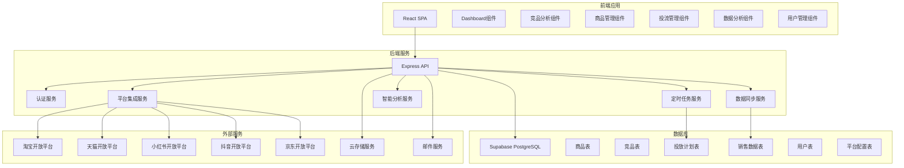
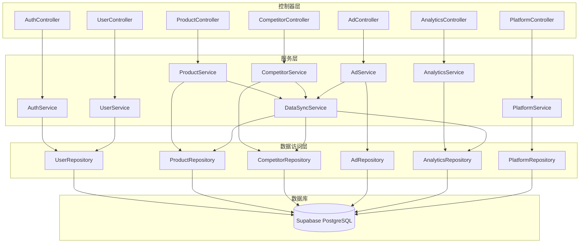
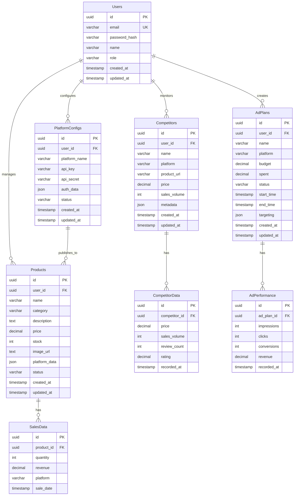

# 陇渭本草全渠道电商自动化运营平台 - 技术架构文档

## 1. Architecture Design



## 2. Technology Description

### 2.1 技术栈
- **前端**: React@18 + TypeScript + TailwindCSS@3 + Vite
- **状态管理**: Zustand
- **路由**: React Router DOM
- **图表库**: Recharts
- **图标**: Lucide React
- **后端**: Express@4 + TypeScript
- **数据库**: Supabase (PostgreSQL)
- **认证**: Supabase Auth
- **定时任务**: Node-cron
- **API集成**: Axios
- **部署**: Vercel (前端) + Railway (后端)

### 2.2 项目结构
```
ZD/
├── src/                    # 前端代码
│   ├── components/         # 公共组件
│   ├── pages/              # 页面组件
│   ├── hooks/              # 自定义hooks
│   ├── stores/             # Zustand状态管理
│   ├── utils/              # 工具函数
│   ├── api/                # API调用
│   ├── types/              # 类型定义
│   └── assets/             # 静态资源
├── api/                    # 后端代码
│   ├── controllers/        # 控制器
│   ├── services/           # 服务层
│   ├── routes/             # 路由定义
│   ├── middleware/         # 中间件
│   ├── config/             # 配置文件
│   └── utils/              # 工具函数
├── supabase/               # Supabase配置
├── migrations/             # 数据库迁移
├── shared/                 # 共享类型定义
└── .trae/documents/        # 文档
```

## 3. Route Definitions

| Route | Purpose |
|-------|---------|
| / | Dashboard首页 |
| /competitor | 竞品分析页面 |
| /products | 商品管理页面 |
| /products/add | 添加商品页面 |
| /products/edit/:id | 编辑商品页面 |
| /ads | 投流管理页面 |
| /ads/create | 创建投放计划页面 |
| /analytics | 数据分析页面 |
| /platforms | 平台接入页面 |
| /users | 用户管理页面 |
| /users/add | 添加用户页面 |
| /settings | 系统设置页面 |
| /login | 登录页面 |
| /register | 注册页面 |

## 4. API Definitions

### 4.1 认证接口
| Method | Endpoint | Description |
|--------|----------|-------------|
| POST | /api/auth/login | 用户登录 |
| POST | /api/auth/register | 用户注册 |
| GET | /api/auth/me | 获取当前用户信息 |
| POST | /api/auth/logout | 用户退出 |

### 4.2 商品接口
| Method | Endpoint | Description |
|--------|----------|-------------|
| GET | /api/products | 获取商品列表 |
| POST | /api/products | 添加商品 |
| GET | /api/products/:id | 获取商品详情 |
| PUT | /api/products/:id | 更新商品 |
| DELETE | /api/products/:id | 删除商品 |
| POST | /api/products/sync | 同步平台商品 |
| POST | /api/products/publish | 发布商品到平台 |

### 4.3 竞品接口
| Method | Endpoint | Description |
|--------|----------|-------------|
| GET | /api/competitors | 获取竞品列表 |
| POST | /api/competitors | 添加竞品 |
| GET | /api/competitors/:id | 获取竞品详情 |
| PUT | /api/competitors/:id | 更新竞品 |
| DELETE | /api/competitors/:id | 删除竞品 |
| GET | /api/competitors/analysis | 获取竞品分析数据 |

### 4.4 投流接口
| Method | Endpoint | Description |
|--------|----------|-------------|
| GET | /api/ads | 获取投放计划列表 |
| POST | /api/ads | 创建投放计划 |
| GET | /api/ads/:id | 获取投放计划详情 |
| PUT | /api/ads/:id | 更新投放计划 |
| DELETE | /api/ads/:id | 删除投放计划 |
| POST | /api/ads/start | 启动投放 |
| POST | /api/ads/stop | 停止投放 |
| GET | /api/ads/analytics | 获取投放效果数据 |

### 4.5 数据分析接口
| Method | Endpoint | Description |
|--------|----------|-------------|
| GET | /api/analytics/sales | 获取销售数据 |
| GET | /api/analytics/traffic | 获取流量数据 |
| GET | /api/analytics/conversion | 获取转化数据 |
| GET | /api/analytics/report | 获取综合报表 |

### 4.6 用户接口
| Method | Endpoint | Description |
|--------|----------|-------------|
| GET | /api/users | 获取用户列表 |
| POST | /api/users | 添加用户 |
| GET | /api/users/:id | 获取用户详情 |
| PUT | /api/users/:id | 更新用户 |
| DELETE | /api/users/:id | 删除用户 |

### 4.7 平台配置接口
| Method | Endpoint | Description |
|--------|----------|-------------|
| GET | /api/platforms | 获取平台配置列表 |
| POST | /api/platforms | 添加平台配置 |
| PUT | /api/platforms/:id | 更新平台配置 |
| DELETE | /api/platforms/:id | 删除平台配置 |
| POST | /api/platforms/test | 测试平台连接 |

## 5. Server Architecture Diagram



## 6. Data Model

### 6.1 Data Model Definition



### 6.2 Data Definition Language

```sql
-- Users Table
CREATE TABLE users (
    id UUID PRIMARY KEY DEFAULT gen_random_uuid(),
    email VARCHAR(255) UNIQUE NOT NULL,
    password_hash VARCHAR(255) NOT NULL,
    name VARCHAR(100) NOT NULL,
    role VARCHAR(50) DEFAULT 'user',
    created_at TIMESTAMP DEFAULT CURRENT_TIMESTAMP,
    updated_at TIMESTAMP DEFAULT CURRENT_TIMESTAMP
);

-- Products Table
CREATE TABLE products (
    id UUID PRIMARY KEY DEFAULT gen_random_uuid(),
    user_id UUID REFERENCES users(id),
    name VARCHAR(255) NOT NULL,
    category VARCHAR(100),
    description TEXT,
    price DECIMAL(10, 2) NOT NULL,
    stock INT DEFAULT 0,
    image_url VARCHAR(500),
    platform_data JSONB,
    status VARCHAR(50) DEFAULT 'draft',
    created_at TIMESTAMP DEFAULT CURRENT_TIMESTAMP,
    updated_at TIMESTAMP DEFAULT CURRENT_TIMESTAMP
);

-- Competitors Table
CREATE TABLE competitors (
    id UUID PRIMARY KEY DEFAULT gen_random_uuid(),
    user_id UUID REFERENCES users(id),
    name VARCHAR(255) NOT NULL,
    platform VARCHAR(50) NOT NULL,
    product_url VARCHAR(500),
    price DECIMAL(10, 2),
    sales_volume INT,
    metadata JSONB,
    created_at TIMESTAMP DEFAULT CURRENT_TIMESTAMP,
    updated_at TIMESTAMP DEFAULT CURRENT_TIMESTAMP
);

-- CompetitorData Table
CREATE TABLE competitor_data (
    id UUID PRIMARY KEY DEFAULT gen_random_uuid(),
    competitor_id UUID REFERENCES competitors(id),
    price DECIMAL(10, 2),
    sales_volume INT,
    review_count INT,
    rating DECIMAL(3, 2),
    recorded_at TIMESTAMP DEFAULT CURRENT_TIMESTAMP
);

-- AdPlans Table
CREATE TABLE ad_plans (
    id UUID PRIMARY KEY DEFAULT gen_random_uuid(),
    user_id UUID REFERENCES users(id),
    name VARCHAR(255) NOT NULL,
    platform VARCHAR(50) NOT NULL,
    budget DECIMAL(12, 2) NOT NULL,
    spent DECIMAL(12, 2) DEFAULT 0,
    status VARCHAR(50) DEFAULT 'pending',
    start_time TIMESTAMP,
    end_time TIMESTAMP,
    targeting JSONB,
    created_at TIMESTAMP DEFAULT CURRENT_TIMESTAMP,
    updated_at TIMESTAMP DEFAULT CURRENT_TIMESTAMP
);

-- AdPerformance Table
CREATE TABLE ad_performance (
    id UUID PRIMARY KEY DEFAULT gen_random_uuid(),
    ad_plan_id UUID REFERENCES ad_plans(id),
    impressions INT DEFAULT 0,
    clicks INT DEFAULT 0,
    conversions INT DEFAULT 0,
    revenue DECIMAL(12, 2) DEFAULT 0,
    recorded_at TIMESTAMP DEFAULT CURRENT_TIMESTAMP
);

-- SalesData Table
CREATE TABLE sales_data (
    id UUID PRIMARY KEY DEFAULT gen_random_uuid(),
    product_id UUID REFERENCES products(id),
    quantity INT DEFAULT 0,
    revenue DECIMAL(10, 2) DEFAULT 0,
    platform VARCHAR(50),
    sale_date TIMESTAMP DEFAULT CURRENT_TIMESTAMP
);

-- PlatformConfigs Table
CREATE TABLE platform_configs (
    id UUID PRIMARY KEY DEFAULT gen_random_uuid(),
    user_id UUID REFERENCES users(id),
    platform_name VARCHAR(50) NOT NULL,
    api_key VARCHAR(255),
    api_secret VARCHAR(255),
    auth_data JSONB,
    status VARCHAR(50) DEFAULT 'disabled',
    created_at TIMESTAMP DEFAULT CURRENT_TIMESTAMP,
    updated_at TIMESTAMP DEFAULT CURRENT_TIMESTAMP
);

-- Indexes
CREATE INDEX idx_products_user_id ON products(user_id);
CREATE INDEX idx_competitors_user_id ON competitors(user_id);
CREATE INDEX idx_competitor_data_competitor_id ON competitor_data(competitor_id);
CREATE INDEX idx_ad_plans_user_id ON ad_plans(user_id);
CREATE INDEX idx_ad_performance_ad_plan_id ON ad_performance(ad_plan_id);
CREATE INDEX idx_sales_data_product_id ON sales_data(product_id);
CREATE INDEX idx_platform_configs_user_id ON platform_configs(user_id);

-- Grant Permissions
GRANT SELECT ON users TO anon;
GRANT SELECT ON products TO anon;
GRANT SELECT ON competitors TO anon;
GRANT SELECT ON competitor_data TO anon;
GRANT SELECT ON ad_plans TO anon;
GRANT SELECT ON ad_performance TO anon;
GRANT SELECT ON sales_data TO anon;
GRANT SELECT ON platform_configs TO anon;

GRANT ALL PRIVILEGES ON users TO authenticated;
GRANT ALL PRIVILEGES ON products TO authenticated;
GRANT ALL PRIVILEGES ON competitors TO authenticated;
GRANT ALL PRIVILEGES ON competitor_data TO authenticated;
GRANT ALL PRIVILEGES ON ad_plans TO authenticated;
GRANT ALL PRIVILEGES ON ad_performance TO authenticated;
GRANT ALL PRIVILEGES ON sales_data TO authenticated;
GRANT ALL PRIVILEGES ON platform_configs TO authenticated;
```

## 7. 安全考虑

### 7.1 认证与授权
- 使用JWT令牌进行身份验证
- 基于角色的访问控制(RBAC)
- 密码使用bcrypt加密存储

### 7.2 数据安全
- API密钥加密存储
- 敏感数据传输使用HTTPS
- 定期数据备份

### 7.3 接口安全
- 请求频率限制
- 参数校验
- SQL注入防护
- XSS防护

## 8. 部署方案

### 8.1 前端部署
- 部署平台: Vercel
- 构建命令: `pnpm build`
- 环境变量: Supabase URL, Supabase Anon Key

### 8.2 后端部署
- 部署平台: Railway
- 启动命令: `pnpm start`
- 环境变量: Supabase URL, Supabase Service Role Key, API Keys

### 8.3 数据库部署
- 使用Supabase托管PostgreSQL数据库
- 配置自动备份
- 设置数据加密